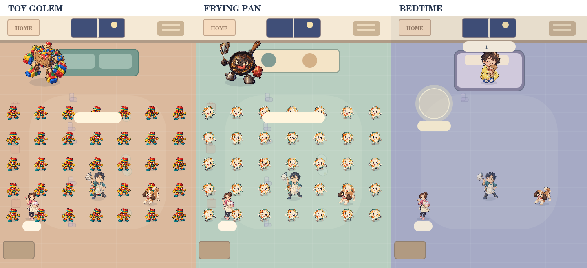
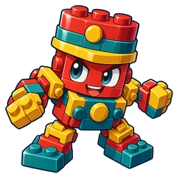
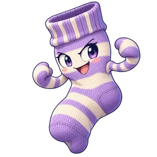
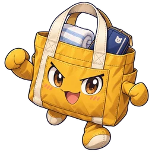
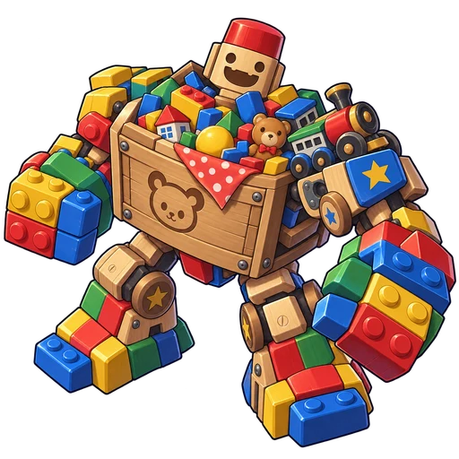
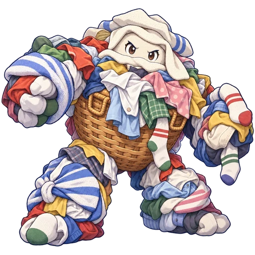
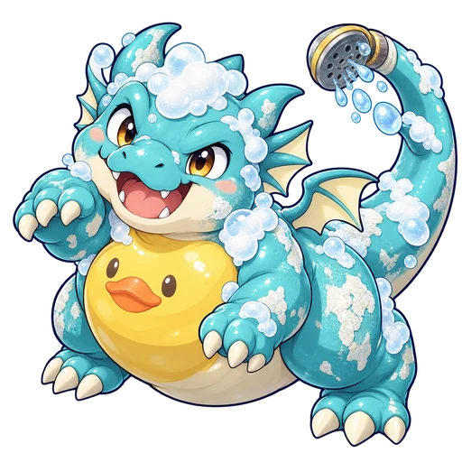
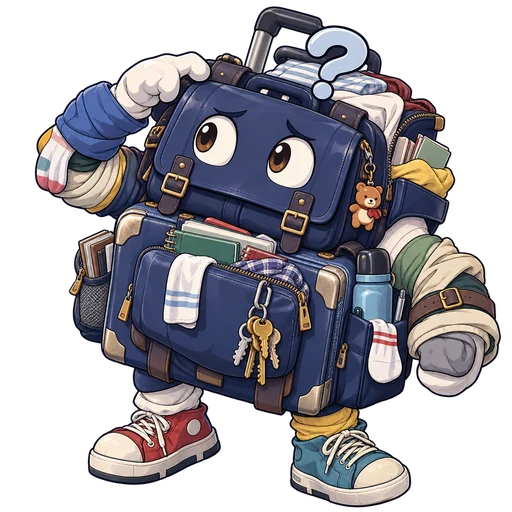

# 第2作 キャラクターイラスト

2026-09-22。未公開の制作ブランチ `codex/hayaku-illustrated-characters`。組み込みの画像生成（built-in imagegen）で1素材ずつ作成。背景透過を保持したWebPを実際のゲーム描画に使用。

雑魚8種類、家事ボス5体、子ども2表情、勇者・ママ・ポチの18点。子どもは人間の姿のまま、攻撃対象にはしない。朝は枕・パン・泡・靴下と子どもの画像を使用し、朝全体の障害を裏ボスとして扱う構成は変更なし。

上は本番のPainterをCanvas互換実装で描画した検証画像。日本語フォント不足により文字は未確認。スマホ実機スクリーンショットではない。

| 名前 | イラスト |
|---|---|
| おもちゃブロック兵 |  |
| よごれ皿ランナー |  |
| くつしたジャンパー |  |
| あわあわスライム |  |
| わすれものバッグ |  |
| おめめぱっちりスター |  |
| ねぼすけまくら |  |
| 散らかしゴーレム |  |
| トーストダッシュ |  |
| 焦げつきフライパン魔人 |  |
| 洗濯マウンテン |  |
| 水あかドラゴン |  |
| 忘れ物魔人「アレガナイ」 |  |
| まだ、ねむくない！ |  |
| 早く寝たい勇者 |  |
| ママ |  |
| ポチ |  |
| すやすや |  |

## 実装・検証

- 18点の透過WebP（雑魚256px、その他512px）。全画像のalpha最小0・最大255を確認。
- 読み込みは各画像1回。通信エラー・12秒のタイムアウトでは従来描画に戻り、ゲームを止めない。
- 大人とポチの睡眠姿、背景・家具・技エフェクトは既存の図形描画を維持。子どもの睡眠姿は専用イラスト。
- 当たり判定・難易度・敵数・両エンディングの分岐は変更しない。タイムボタン撤去コミット240703dを継承。
- Nodeテスト31件成功。画像対応、成功/失敗/待機中のローダー、描画呼び分け、従来のゲーム進行・入力回帰を検証。
- 第1作のゲームファイル・素材はa7413faから差分なし。mainと公開URLは更新しない。
- 実ブラウザーでの表示、スマホのタッチ・読み込み時間・FPS・操作感は未確認。
- 将来の公開時にWebPを配信先へコピーする設定を追加。公開用フォルダに生成プロンプトやテストは入れない。

生成プロンプト全文：[prompts.json](../../games/hayaku-netai-yusha/assets/characters/prompts.json)。素材保存先：`games/hayaku-netai-yusha/assets/characters/`。

